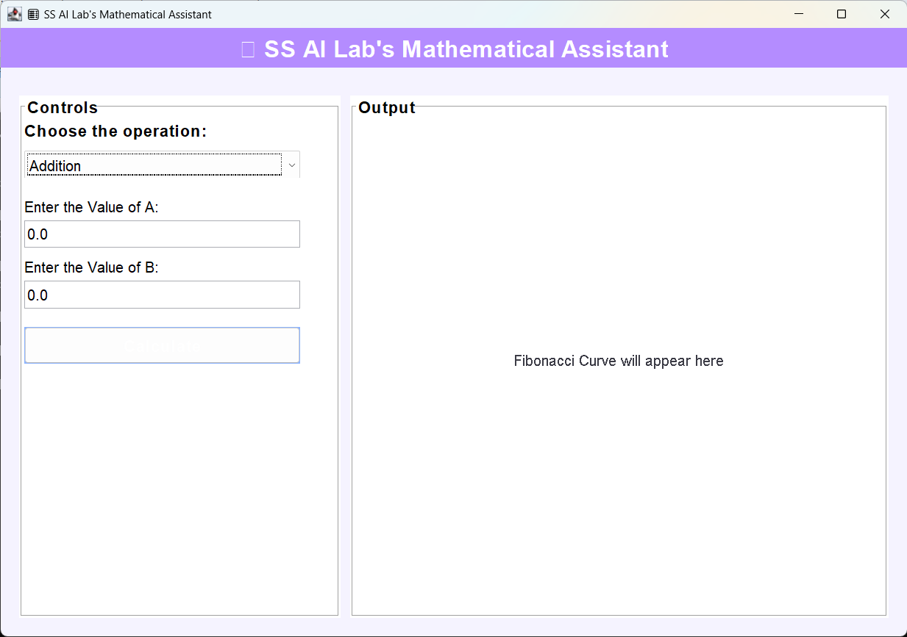
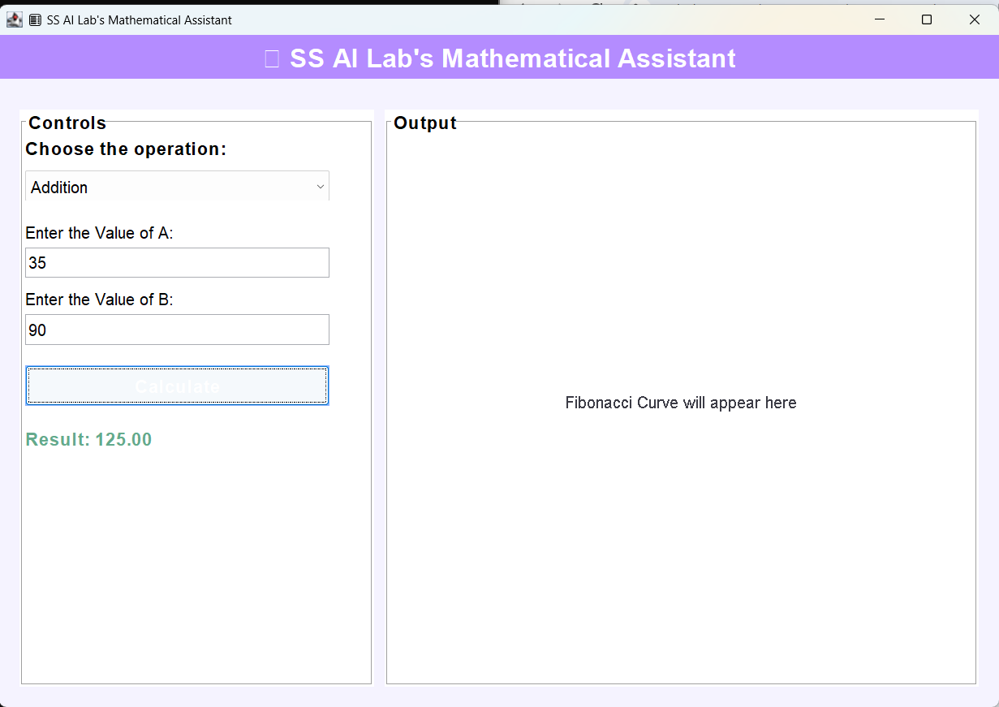
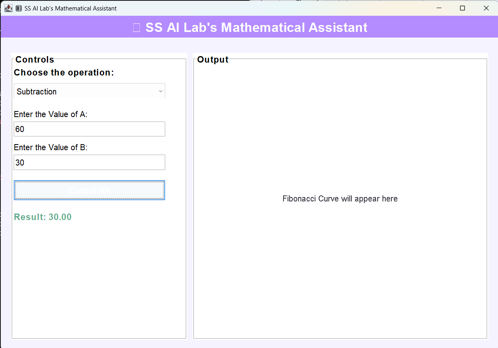
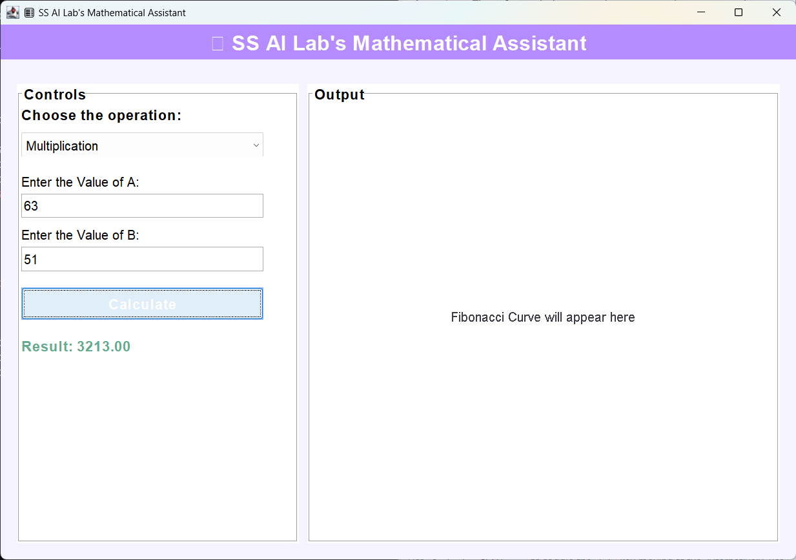
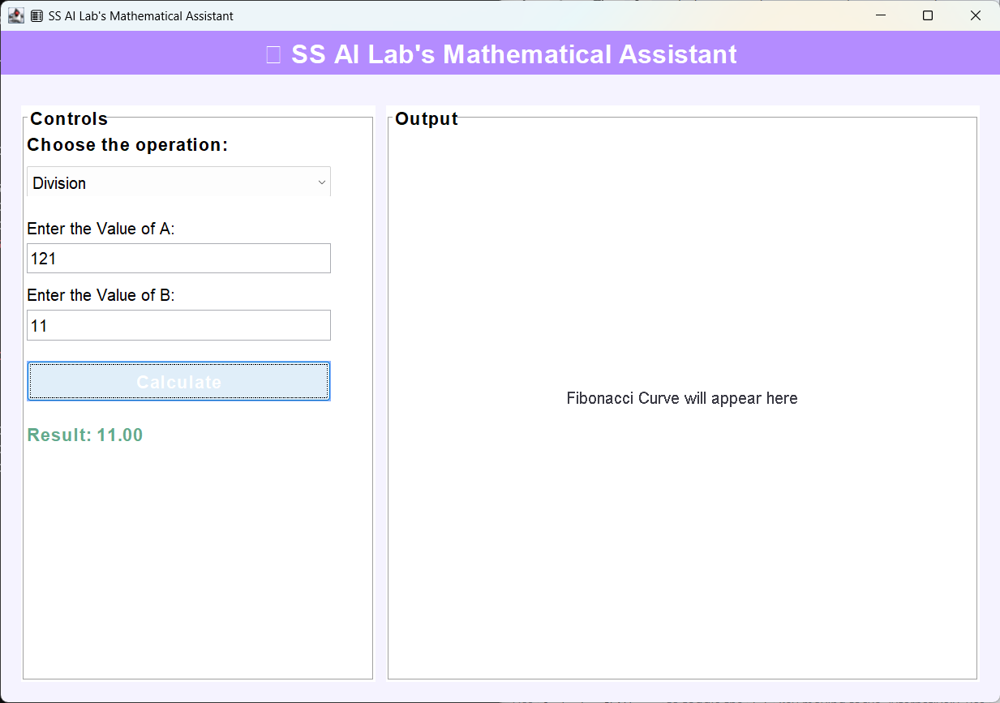
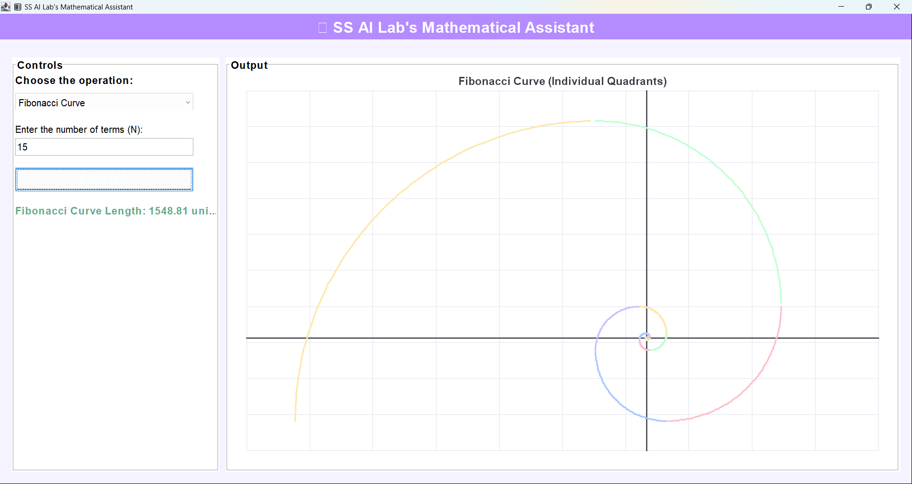

# 🧮 Mathematical Assistant

A Java-based desktop application that performs arithmetic operations and visualizes the Fibonacci spiral through an interactive graphical user interface. The application is built using Java Swing and AWT, providing users with both computational and graphical mathematical tools in a clean, user-friendly environment.

It also includes a web version built using Spring Boot, HTML, CSS, and JavaScript, making the application accessible through a browser.

---
## 📌 Project Overview

The Mathematical Assistant combines basic arithmetic calculations with graphical visualization of the Fibonacci sequence. Users can perform operations such as addition, subtraction, multiplication, and division, while also exploring the Fibonacci spiral through dynamic graphical plotting.

It replicates the design and behavior of the Python Streamlit app [Math01](https://math01-gcujq4iq4nfavwz3tg9bur.streamlit.app/).

The project was later extended into a web application using Spring Boot and deployed online using Render.com.

---

## ✨ Features

### ➕ Arithmetic Operations
- Addition
- Subtraction
- Multiplication
- Division (with error handling for divide-by-zero)

### 🌀 Fibonacci Visualization
- Dynamic Fibonacci spiral generation
- Coordinate grid and axes
- Color-coded curve segments
- Automatic scaling for better visualization

### 🎨 UI Features
- Clean pastel-themed interface
- Interactive input fields
- Real-time calculation updates
- Responsive layout design
- Error handling for invalid inputs

---

## 🛠️ Technologies Used

### Programming Language
- Java

### Desktop GUI
- Java Swing
- AWT (Abstract Window Toolkit)

### Web Version
- Spring Boot
- HTML
- CSS
- JavaScript

### Deployment & Tools
- Docker
- Maven
- GitHub
- Render.com

---

## 📂 Project Structure

```text
Math-Assistant/
│
├── src/
│   ├── FibonacciGUI.java
│   ├── FibonacciGUI.class
│   ├── FibonacciCalculator.class
│   ├── FibonacciGUI$FibonacciPlotPanel.class
│   └── FibonacciCalculator$CurveSegment.class
│
├── images/
│   ├── Home.png
│   ├── Addition.png
│   ├── Subtraction.png
│   ├── Multiplication.png
│   ├── Division.png
│   └── Fibonacci.png
│
├── demo/
│   └── demo.mp4
│
├── public/
├── index.html
├── vercel.json
├── FibonacciGUI.jar
└── README.md
```

---

## 🚀 How to Run (Desktop Version)

### 🔹 Step 1: Clone Repository
```bash
git clone https://github.com/Sushmitaa-B/Math-Assistant.git
```

### 🔹 Step 2: Navigate to Source Folder
```bash
cd Math-Assistant/src
```

### 🔹 Step 3: Compile
```bash
javac FibonacciGUI.java
```

### 🔹 Step 4: Run
```bash
java FibonacciGUI
```

---

## ⚡ Run Using JAR File

```bash
java -jar FibonacciGUI.jar
```

---

## 🌐 Live Web Application

🔗 https://math-lab-1.onrender.com

The web version includes:
- REST API-based arithmetic operations
- Fibonacci spiral visualization using Canvas
- Responsive UI for browser access

---

## 📸 Screenshots

### 🏠 Home Screen


### ➕ Addition


### ➖ Subtraction


### ✖️ Multiplication


### ➗ Division


### 🌀 Fibonacci Spiral


---

## 🎥 Project Demo

📹 Watch Full Demo:
[Demo Video](demo/demo.mp4)

---

## 🎯 Learning Outcomes

- Java Programming (OOP Concepts)
- GUI Development using Swing & AWT
- Event-driven programming
- Mathematical visualization techniques
- REST API development using Spring Boot
- Frontend development (HTML, CSS, JavaScript)
- Docker containerization
- Cloud deployment using Render
- Full-stack application development

---

## 👩‍💻 Author

**B. Sushmitaa**  
B.Tech – Artificial Intelligence and Data Science  
Mount Zion College of Engineering and Technology  
Pudukkottai, Tamil Nadu, India  

GitHub: https://github.com/Sushmitaa-B

---

## 📜 License

This project is created for educational and learning purposes.
